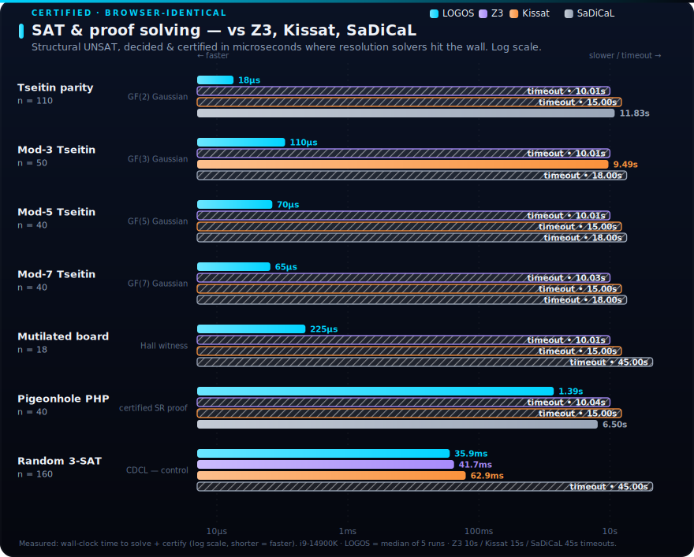
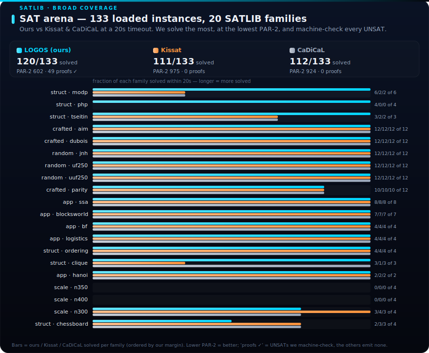
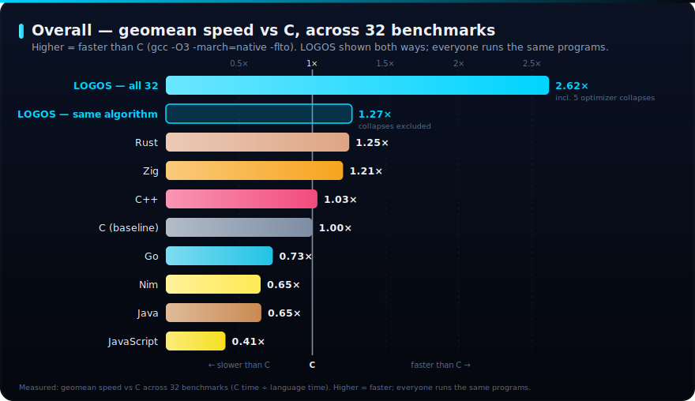
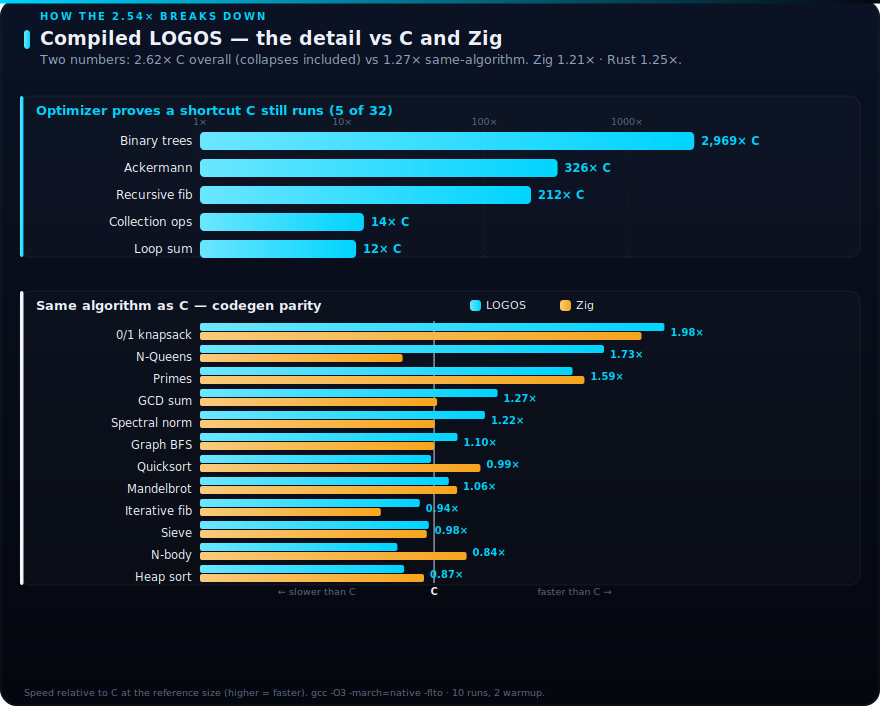
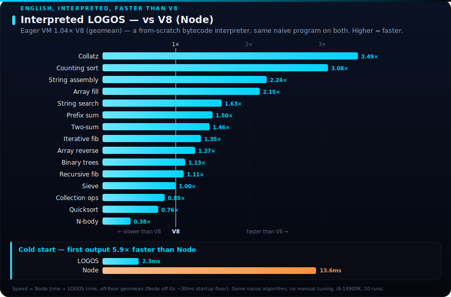
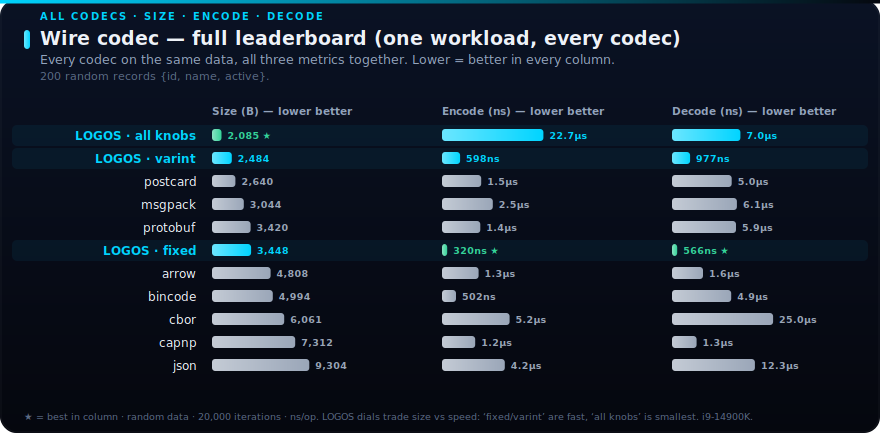
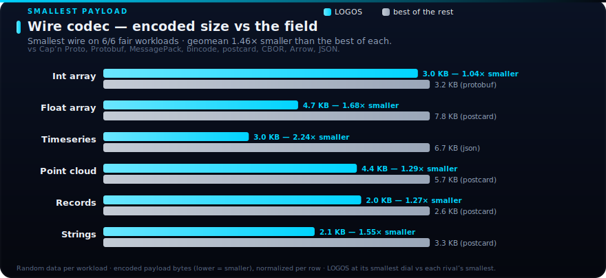
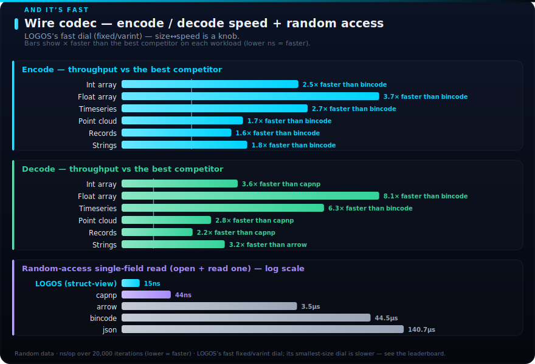

# Logicaffeine

**Our mission: compile the universe's information. Not collect — *compile*, like code.**

[](https://github.com/Brahmastra-Labs/logicaffeine/actions/workflows/test.yml)
[]()
[](https://github.com/Brahmastra-Labs/logicaffeine/actions/workflows/test.yml)
[](LICENSE.md)

**[Try LOGOS online →](https://logicaffeine.com/studio)**

---

## What is it?

Logicaffeine is a **natural-language compiler**. You write English; it emits a formal artifact.
It has two modes, sharing one parser:

| Mode | Input | Output |
|------|-------|--------|
| **Imperative** | English programs | Executable code (Rust, WASM, and an in-process interpreter/VM/JIT) |
| **Logic** | English sentences | First-Order Logic (∀, ∃, →, ∧, …) |

The programming language is called **LOGOS**.

**Imperative mode** — English → Rust:

```logos
## To classify (n: Int) -> Text:
    If n is less than 0:
        Return "negative".
    Return "non-negative".
```
↓
```rust
#[inline]
fn classify(n: i64) -> String {
    if (n < 0) {
        return String::from("negative");
    }
    return String::from("non-negative");
}
```
*That is the actual generated code — LOGOS even emits optimization hints like `#[inline]` itself.*

**Logic mode** — English → First-Order Logic:

```
"Every man is mortal."   →   ∀x((Man(x) → Mortal(x)))
```

Why not just ask an LLM? LLMs are probabilistic — they guess. LOGOS is deterministic — it parses.
When *"every woman loves a man"* has two readings, a model picks one; LOGOS returns both.

> **Early access.** LOGOS is well-tested but the language surface is still stabilizing and subject
> to change. Please file bugs and feature requests via GitHub issues.

---

## Table of contents

- [Quick start](#quick-start)
- [A complete example: merge sort](#a-complete-example-merge-sort)
- [What's inside](#whats-inside) — the feature pillars
- [Benchmarks](#benchmarks) — measured, not asserted
- [Workspace map](#workspace-map) — the crates
- [Documentation](#documentation) — the guides
- [Project](#project) — roadmap, changelog, contributing, license

---

## Quick start

### Install

One line, no toolchain (Linux and macOS, x64 + arm64):

```bash
curl -fsSL https://logicaffeine.com/install.sh | sh
```

Windows:

```powershell
powershell -ExecutionPolicy Bypass -c "irm https://logicaffeine.com/install.ps1 | iex"
```

That installs `largo`, the LOGOS build tool. Add `--full` (`sh -s -- --full`) for the build
with Z3 static verification bundled. Every download is SHA-256-verified against the release's
`SHA256SUMS`; nothing runs as root and no shell config is edited. Prefer cargo?
`cargo install logicaffeine-cli` works too.

```bash
largo new hello && cd hello && largo run     # compile to native and run
largo repl                                    # the interactive session
largo logic "Every woman loves a man."        # English → ∀x(woman(x) → ∃y(man(y) ∧ love(x,y)))
```

### Try online

No install required — [open the Studio playground at logicaffeine.com/studio →](https://logicaffeine.com/studio).
The full engine (parser, interpreter, proof engine, code generation) runs client-side in WebAssembly.

### Local development

```bash
# Build the workspace
cargo build

# Run the tests (skips slow e2e; no Z3 toolchain needed)
cargo test -- --skip e2e

# Launch the web IDE — run from the repo root, not the app dir
dx serve -p logicaffeine-web

# Build the largo CLI, then scaffold and run a project
cargo build -p logicaffeine-cli
./target/debug/largo new my_project && cd my_project && ../target/debug/largo run
```

### As a library

```rust
// Logic mode: English → First-Order Logic
let fol = logicaffeine_language::compile("Every man is mortal.")?;
// → "∀x((Man(x) → Mortal(x)))"

// Imperative mode: English → a self-contained Rust module
let rust = logicaffeine_compile::compile_to_rust("## Main\nReturn 42.")?;
// → a module that runs `Main` on a large-stack worker thread
```

Both return `Result<String, ParseError>`. See
[`logicaffeine_language`](crates/logicaffeine_language/README.md) and
[`logicaffeine_compile`](crates/logicaffeine_compile/README.md).

---

## A complete example: merge sort

A full recursive algorithm — functions, typed collections, 1-indexed inclusive slicing,
ownership (`copy of`), and control flow — written entirely in English. This program compiles and
runs ([`grand_challenge_mergesort.rs`](crates/logicaffeine_tests/tests/grand_challenge_mergesort.rs)):

```logos
## To Merge (left: Seq of Int) and (right: Seq of Int) -> Seq of Int:
    Let result be a new Seq of Int.
    Let i be 1.
    Let j be 1.
    Let n_left be length of left.
    Let n_right be length of right.

    While i is at most n_left and j is at most n_right:
        Let l_val be item i of left.
        Let r_val be item j of right.
        If l_val is less than r_val:
            Push l_val to result.
            Set i to i + 1.
        Otherwise:
            Push r_val to result.
            Set j to j + 1.

    While i is at most n_left:
        Let v be item i of left.
        Push v to result.
        Set i to i + 1.
    While j is at most n_right:
        Let v be item j of right.
        Push v to result.
        Set j to j + 1.

    Return result.

## To MergeSort (items: Seq of Int) -> Seq of Int:
    Let n be length of items.
    If n is less than 2:
        Return copy of items.
    Let mid be n / 2.
    Let left_slice be items 1 through mid.
    Let right_slice be items (mid + 1) through n.
    Let sorted_left be MergeSort(copy of left_slice).
    Let sorted_right be MergeSort(copy of right_slice).
    Return Merge(sorted_left, sorted_right).

## Main
    Let numbers be a new Seq of Int.
    Push 3 to numbers. Push 1 to numbers. Push 4 to numbers.
    Push 1 to numbers. Push 5 to numbers.
    Let sorted be MergeSort(numbers).
    Show sorted.
```

→ [the imperative-mode guide](docs/imperative-mode.md) covers each construct in depth.

---

## What's inside

Eight pillars. Each blurb links to a deeper, code-grounded guide.

### ⚙️ Imperative LOGOS — English that runs
A statically-typed language: variables and mutation, a rich primitive set (`Int`, `Nat`, `Real`,
`Rational`, `Bool`, `Text`, `Uuid`, machine words `Word8`–`Word64`), user structs, sum-type enums,
generics, closures, **1-indexed** collections with inclusive slices, pattern matching,
ownership/borrow checking, and FFI.
→ **[docs/imperative-mode.md](docs/imperative-mode.md)**

### 🧠 Logic LOGOS — English that means something
English → First-Order Logic with deep linguistic coverage: quantifiers, modal logic (Kripke
semantics), tense/aspect and LTL, neo-Davidsonian event semantics, scope ambiguity enumeration,
λ-calculus/Montague types, and a long tail of phenomena (presupposition, ellipsis, counterfactuals,
binding…). → **[docs/logic-mode.md](docs/logic-mode.md)**

### 🚀 Five ways to run it
One front-end, many back-ends: a tree-walking interpreter, a register bytecode VM, **EXODIA** — a
copy-and-patch JIT (native), AOT Rust codegen, and a direct WASM backend (`largo build --emit wasm`,
no rustc in the loop) — plus an experimental AOT C emitter. All benchmarked against C and V8.
→ **[docs/execution-and-performance.md](docs/execution-and-performance.md)**

### ✅ Proof & verification
A pure Calculus-of-Constructions kernel with decision procedures (`ring`/`lia`/`cc`/`omega`), a
backward-chaining proof engine with Socratic hints, optional Z3 static verification, and translation
validation that proves the emitted Rust matches the source. → **[docs/proof-and-verification.md](docs/proof-and-verification.md)**

### 🌐 Concurrency & distributed systems
Structured concurrency, channels and `Select`, agents/message-passing, **8 CRDT types**, a
deterministic (seed-replayable) scheduler, and networking via libp2p mesh + a thin WebSocket relay.
→ **[docs/concurrency.md](docs/concurrency.md)**

### 🔐 Cryptography written in LOGOS
The stdlib's crypto layer is LOGOS source, not FFI: post-quantum **ML-KEM-768**, ChaCha20, and
RFC 9562 UUIDs — every version, with the MD5 and SHA-1 digests implemented in LOGOS in
[`uuid.lg`](crates/logicaffeine_compile/assets/std/uuid.lg) — built on `Word8`–`Word64` and SIMD
lane types. ML-DSA-65 signing and the full Keccak/SHA-3 sponge are written in LOGOS in the test
corpus, all bit-exact against FIPS and reference oracles on every execution tier.
→ **[docs/imperative-mode.md](docs/imperative-mode.md)**

### 🎓 Studio IDE + Learn Logic
A browser IDE (Logic / Code / Math / Hardware modes, streaming REPL, compile-to-Rust) and a gamified
curriculum (four eras, SM-2 spaced repetition) — all running in WASM. → **[docs/studio-and-learn.md](docs/studio-and-learn.md)**

### 📦 `largo` — the build tool
A Cargo-style front door to the whole engine — 23 subcommands: projects (`new`/`init`/`add`/`clean`),
build & run (`build`, `run`, `check`, `emit rust|c|wasm`, `fmt`, `opts`), logic & proof (`logic`,
`prove`, `sat`, `verify`), the interactive `repl`, `doc`, `doctor`, and registry auth
(`publish`/`login`/`logout`), driven by a `Largo.toml` manifest. → **[docs/cli.md](docs/cli.md)**

---

## Benchmarks

Measured, not asserted. The interactive suite lives at
[logicaffeine.com/benchmarks](https://logicaffeine.com/benchmarks); the charts below are
regenerated from [`benchmarks/results/`](benchmarks/results/) by
[`gen-readme-charts.py`](benchmarks/gen-readme-charts.py).

### SAT & certified proof

<p align="center">
  
</p>

<p align="center">
  
</p>

### Compiled — vs C

<p align="center">
  
</p>

<p align="center">
  
</p>

### Interpreted — vs V8

<p align="center">
  
</p>

### Wire codec

<p align="center">
  
</p>

<p align="center">
  
</p>

<p align="center">
  
</p>

How the execution tiers behind these numbers work →
**[docs/execution-and-performance.md](docs/execution-and-performance.md)**.

---

## Workspace map

Crates are layered into dependency tiers and protected by four architectural invariants — **Milner**
(kernel never sees the lexicon), **Liskov** (proof engine independent of the language), **Lamport**
(data structures are IO-free and WASM-safe), and **Tarski** (verification IR is decoupled from the
main AST). See **[docs/architecture.md](docs/architecture.md)** for the full picture.

| Tier | Crate | Role |
|------|-------|------|
| 0 | [logicaffeine_base](crates/logicaffeine_base/README.md) | Arenas, string interning, spans, errors |
| 0 | [logicaffeine_runtime](crates/logicaffeine_runtime/README.md) | Deterministic concurrency runtime (tokio-free, WASM-safe) |
| 0 | [logicaffeine_forge](crates/logicaffeine_forge/README.md) | Copy-and-patch JIT executable-memory layer (native) |
| 1 | [logicaffeine_lexicon](crates/logicaffeine_lexicon/README.md) | English vocabulary types + compile-time lexicon |
| 1 | [logicaffeine_kernel](crates/logicaffeine_kernel/README.md) | Calculus of Constructions + decision procedures |
| 1 | [logicaffeine_data](crates/logicaffeine_data/README.md) | Runtime values + 8 CRDTs (IO-free) |
| 2 | [logicaffeine_system](crates/logicaffeine_system/README.md) | Platform IO, networking, persistence |
| 2 | [logicaffeine_proof](crates/logicaffeine_proof/README.md) | Backward-chaining proof engine + Socratic hints |
| 3 | [logicaffeine_language](crates/logicaffeine_language/README.md) | English → First-Order Logic pipeline |
| 3 | [logicaffeine_compile](crates/logicaffeine_compile/README.md) | LOGOS compilation: parse → analyze → codegen / interpret / VM |
| 4 | [logicaffeine_jit](crates/logicaffeine_jit/README.md) | Wires the forge JIT into the VM (native) |
| 4 | [logicaffeine_lsp](crates/logicaffeine_lsp/README.md) | Language Server Protocol (`logicaffeine-lsp`) |
| — | [logicaffeine_verify](crates/logicaffeine_verify/README.md) | Z3 static verification (Z3-gated, opt-in) |
| — | [logicaffeine_tv](crates/logicaffeine_tv/README.md) | SMT translation validation (Z3-gated) |
| — | [logicaffeine_synth](crates/logicaffeine_synth/README.md) | EXODIA stencil synthesis & witness checking (Z3-gated) |
| — | [logicaffeine_tests](crates/logicaffeine_tests/README.md) | The integration test suite |
| — | [logicaffeine_wirebench](crates/logicaffeine_wirebench/README.md) | Wire-codec benchmarks vs industry serializers |

> `verify`, `tv`, `synth`, and `wirebench` sit outside `default-members` — plain `cargo build` /
> `cargo test` need no Z3 toolchain; they build when the `verification` feature pulls them in.

**Applications**

| App | What it is |
|-----|-----------|
| [logicaffeine_cli](apps/logicaffeine_cli/README.md) | The `largo` build tool & package manager |
| [logicaffeine_web](apps/logicaffeine_web/README.md) | The Studio IDE + Learn Logic (Dioxus + WASM) |
| [logicaffeine_docs](apps/logicaffeine_docs/README.md) | Documentation app *(standalone, not a workspace member)* |
| [logicaffeine_nano](apps/logicaffeine_nano/README.md) | Minimal embedding example *(standalone, not a workspace member)* |

---

## Documentation

Code-grounded guides live in [`docs/`](docs/):

- [Imperative mode](docs/imperative-mode.md) — the LOGOS language
- [Logic mode](docs/logic-mode.md) — English → First-Order Logic
- [Execution & performance](docs/execution-and-performance.md) — interpreter, VM, JIT, AOT, direct WASM
- [Proof & verification](docs/proof-and-verification.md) — kernel, proof engine, Z3, translation validation
- [Concurrency & distributed](docs/concurrency.md) — channels, agents, CRDTs, networking
- [Studio & Learn](docs/studio-and-learn.md) — the web app
- [The `largo` CLI](docs/cli.md) — build tool & manifest
- [Architecture](docs/architecture.md) — pipeline, tier graph, invariants

The test suite ([`crates/logicaffeine_tests/`](crates/logicaffeine_tests/)) is the living
specification — features are organized into phase tests, with end-to-end differential tests proving
the interpreter, VM, JIT, and AOT paths agree.

---

## Project

- **Changelog** — [CHANGELOG.md](CHANGELOG.md)
- **Versioning policy** — [VERSIONING.md](VERSIONING.md) (lockstep SemVer across the workspace)
- **Contributing** — [CONTRIBUTING.md](CONTRIBUTING.md)
- **Security** — [SECURITY.md](SECURITY.md)
- **License** — [Business Source License 1.1](LICENSE.md)

---

*"In the beginning was the Word, and the Word was with Logic, and the Word was Code."*
